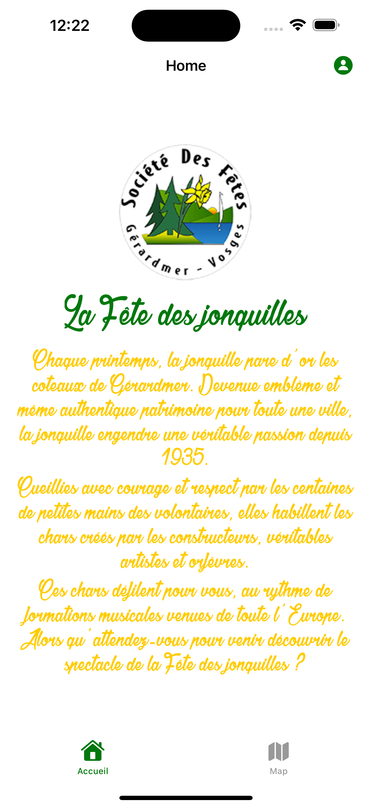
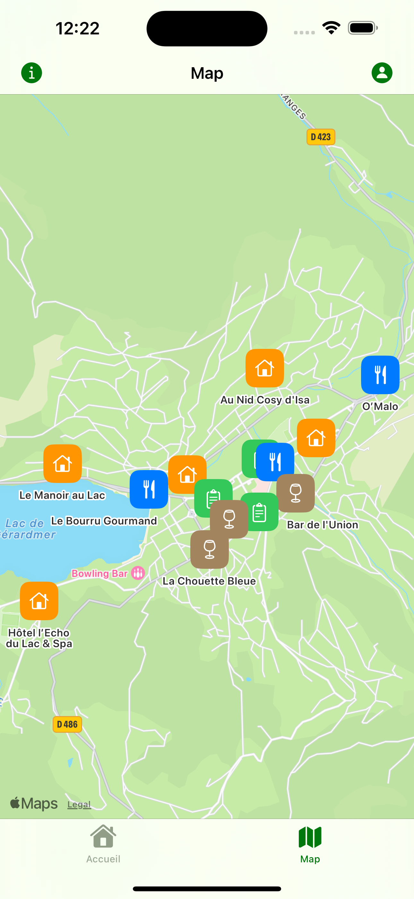
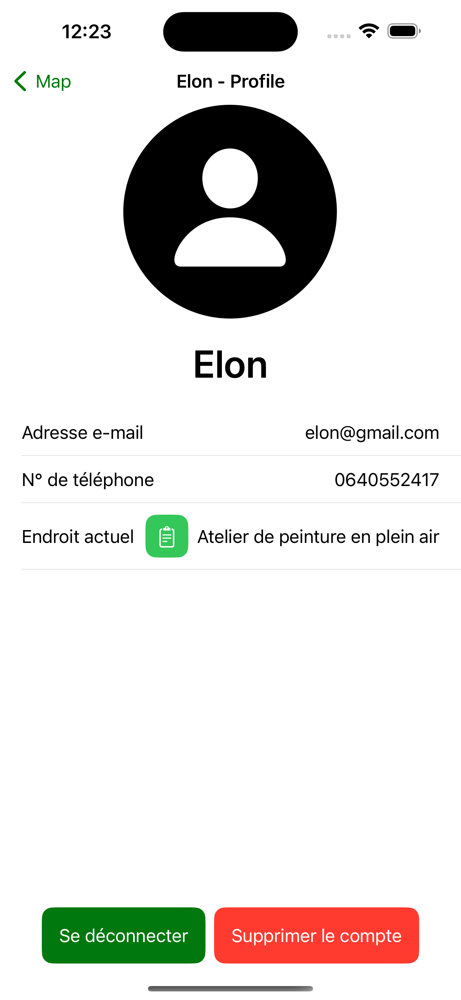
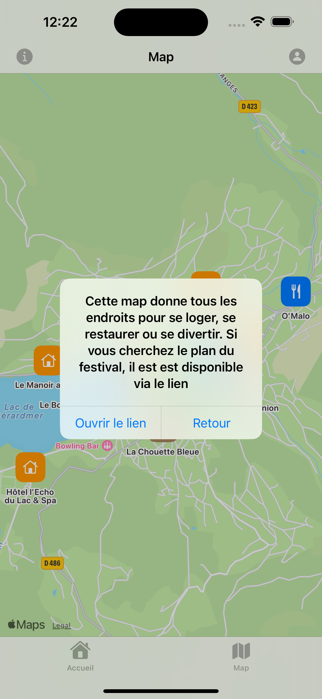
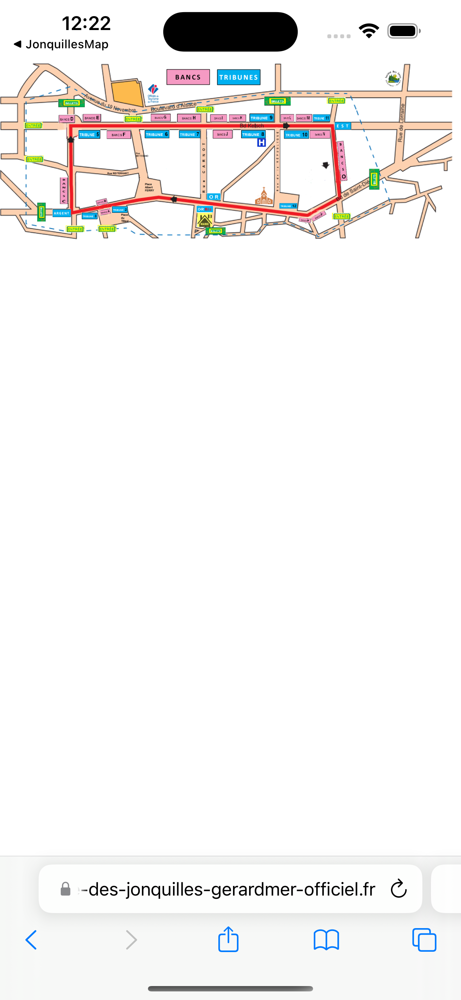
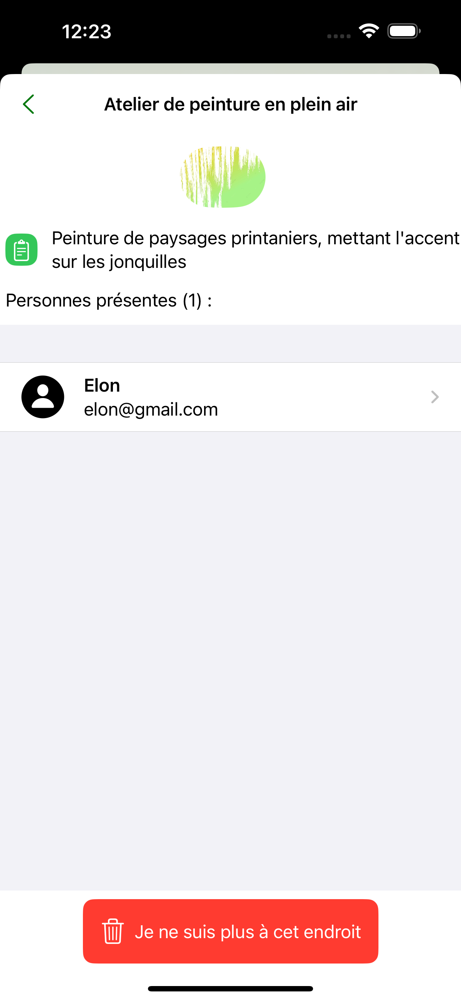
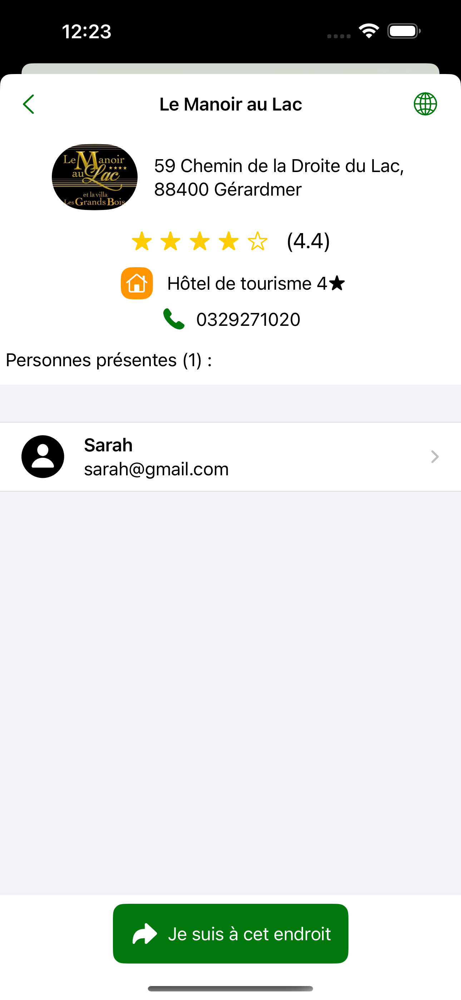
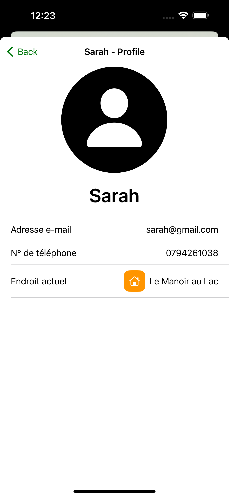
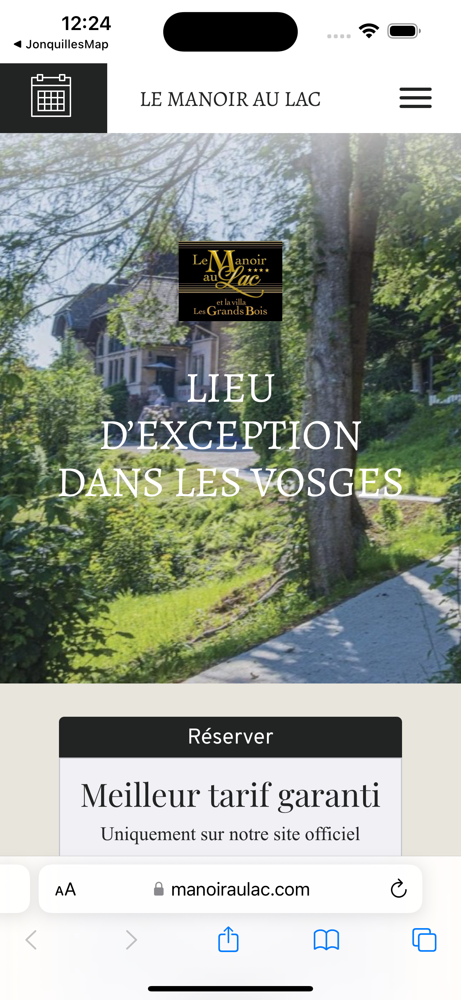

# JonquillesMap
Application iOS sur l'idée de la fête des jonquilles à Gérardmer ([site officiel](https://www.fete-des-jonquilles-gerardmer-officiel.fr/))
*Projet créé pour la 3ème année de BUT Informatique*

## Pré-requis
-  Xcode 15.0.1 ou plus récent /  AppCode
-  iOS 17.0 ou plus récent
-  Swift 5.9 ou plus récent

## 📱 Captures d'écran
### Vues principales
|                            Page d'accueil                            |                                   Map                                   |                               Page de profil                                |
|:--------------------------------------------------------------------:|:-----------------------------------------------------------------------:|:---------------------------------------------------------------------------:|
|  |  |  |

La page de profil est accessible en cliquant sur le bouton en haut à droite de la page d'accueil.
On y trouve également un petit bouton d'information en haut à gauche lorsqu'on est sur la map. Il renvoie une fenêtre d'alerte pour proposer de voir le [plan du festival](https://www.fete-des-jonquilles-gerardmer-officiel.fr/wp-content/uploads/2022/08/220804-Base-vierge-plan-corso-6.png) :

|                                 Alerte                                  |                                 Plan du festival                                  |
|:-----------------------------------------------------------------------:|:---------------------------------------------------------------------------------:|
|  |  |

### Vues secondaires
Lorsqu'on clique sur un des marqueurs de la map, on arrive sur une page secondaire qui affiche les informations du lieu. Un utilisateur peut s'y ajouter ou se retirer du lieu s'il y est déjà et consulter le profil des utilisateurs de la liste. 

|                                                                   Vue du lieu et des utilisateurs présents                                                                   |     Profil d'utilisateur      |
|:----------------------------------------------------------------------------------------------------------------------------------------------------------------------------:|:-----------------------------:|
|   |  |

On peut également cliquer sur le bouton en haut à droite de la vue du lieu pour accéder au site internet du lieu (s'il existe) :

|                                   Site internet du lieu                                    |
|:------------------------------------------------------------------------------------------:|
|  |
